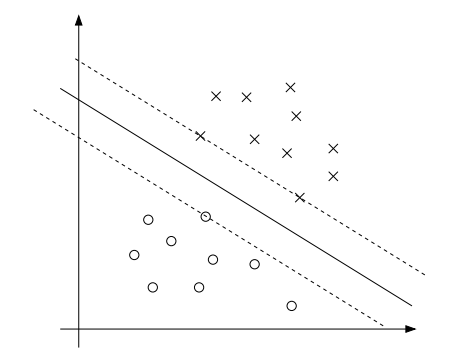

## svm整体思路

### 问题定义

二分类问题，寻找分离超平面 $ {\bf wx}+b = 0 $ 将数据点的正负类分开，同时，使得超平面距离最近的数据点尽可能的远离。

将问题形式化：

给定数据集 $ D = \{{\bf x_i}, y_i\}$, 超平面 $ {\bf wx}+b = 0 $, 

定义函数距离：$ \gamma = y_i({\bf wx}+b) $, 几何距离 $ \hat\gamma = \frac{1}{||w||}y_i({\bf wx}+b) $

​    ***注***：*函数距离随着**w**和b等比例变动，而几何距离不随比例变化。*

**问题**：最大化“最小的几何距离”
$$
\max{\hat\gamma} \\
s.t.\ \ \frac{1}{||{\bf w}||}y_i({\bf wx}+b) \geq \hat\gamma,\ for\ \ i =1... N
$$
**等价于**：
$$
\max{\frac{\gamma}{||{\bf w}||}} \\
s.t.\ \ y_i({\bf wx}+b) \geq \gamma,\ for\ \ i =1... N
$$
**等价于：**
$$
\max\frac{1}{||{\bf w}||} \\ 
s.t.\ \  y_i({\bf wx} + b) \geq 1,\ for\ \ i =1... N
$$
**等价于：**
$$
\min\frac{1}{2}||{\bf w}||^2 \\ 
s.t.\  \ 1-y_i({\bf wx} + b) \leq 0,\ for\ \ i =1... N
$$
这时候已经可以用一些最优化方法进行求解了，但是使用拉格朗日对偶性求解问题通常更容易，且可以引入核函数。

### 拉格朗日对偶性

拉格朗日函数：
$$
\begin{aligned}
L({\bf w},b, {\bf a}) &= \frac{1}{2}||w||^2 + \sum\limits_{i=1}^{N}a_i[1-y_i({\bf wx_i} + b) ] \\
			      &= \frac{1}{2}||w||^2- \sum\limits_{i=1}^{N}a_i[y_i({\bf wx_i} + b)] + \sum\limits_{i=1}^{N}a_i \\
\end{aligned} \\
\\
{\bf s.t.}\ \  a_i \geq 0
$$
因为：
$$
\max\limits_{\bf a}(L) = \begin{cases}

 \frac{1}{2}||w||^2 & \text{ if } a_i \geq 0 \\

 +\infin & \text{ if } a_i \lt 0

\end{cases}
$$
所以问题等价于：
$$
\min\limits_{w,b}\max\limits_aL \\
{\bf s.t.}\ \ a \geq 0
$$
根据拉格朗日对偶性，问题转化为:
$$
\max\limits_a\min\limits_{w,b}L \\
{\bf s.t.}\ \ a \geq 0
$$
(1) 求 $ \min\limits_{w,b}L $: 

$ \frac{\partial L}{\partial w} = w - \sum\limits_{i=1}^Na_ix_iy_i = 0 $     =>   $ w =  \sum\limits_{i=1}^Na_ix_iy_i $

$ \frac{\partial L}{\partial b} = \sum\limits_{i=1}^Na_iy_i = 0 $

(2) 带入$ L(w,b,a) $ 得到：
$$
\begin{aligned}
L(w,b,a) &= \frac{1}{2}\sum\limits_{i=1}^N\sum\limits_{j=1}^Na_ia_j(x_i \cdot x_j) -\sum\limits_{i=1}^N\sum\limits_{j=1}^Na_ia_j(x_i \cdot x_j) + \sum a_i \\
&= -\frac{1}{2}\sum\limits_{i=1}^N\sum\limits_{j=1}^Na_ia_j(x_i \cdot x_j) + \sum a_i 
\end{aligned}
$$
(3) 问题就转化为：
$$
\max\limits_aL(w,b,a) = -\frac{1}{2}\sum\limits_{i=1}^N\sum\limits_{j=1}^Na_ia_j(x_i \cdot x_j) + \sum a_i \\
{\bf s.t.}\ \ a_i \geq 0, \sum\limits_{i=1}^Na_iy_i = 0
$$

### 松弛变量

对于间隔必须大于1的条件引入“松弛变量“，并对它加以相应的惩罚，通过超参数C来控制。
$$
\max\frac{1}{||{\bf w}||} + C\sum\limits_{i=1}^N\xi_i \\ 
s.t.\ \  y_i({\bf wx} + b) \geq 1-\xi_i,\ for\ \ i =1... N
$$
C越大，对于误分类的惩罚越大，C越小，惩罚减小，从而降低对噪点的敏感性，达到防止过拟合的作用。

问题求解和前面类似，使用拉格朗日对偶性求解。

得到：
$$
\max\limits_aL(w,b,a) = -\frac{1}{2}\sum\limits_{i=1}^N\sum\limits_{j=1}^Na_ia_j(x_i \cdot x_j) + \sum a_i \\
{\bf s.t.}\ \ 0 \leq a_i \leq C , \sum\limits_{i=1}^Na_iy_i = 0
$$

### 核函数

用$ K(x_i, x_j) = {\bf \phi(x_i)} \cdot {\bf \phi(x_j)} $ 代替 $ x_i \cdot x_j $，其中 $ {\bf \phi(x)} = [f_1(x_i), f_2(x_i),...,f_m(x_i)] $ 是从x空间映射到高维或无限维的希尔伯特空间，然后在新的空间中度量他们的相似性。 不过映射的过程通常是隐式的，直接通过定义K函数的方式来实现。如果$ \phi $是非线性的，模型就具备了非线性能力。

